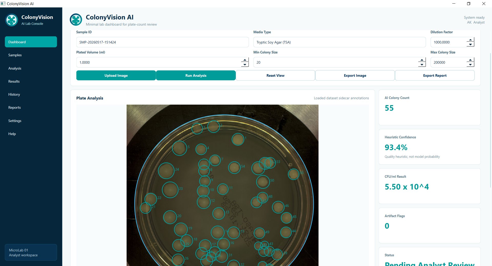

# ColonyVision AI 🔬

<div align="center">


**A local AI-assisted microbiology dashboard for colony counting, analyst review, CFU/ml calculation, and exportable plate-count reports.**

[Features](#-key-features) · [Installation](#-installation) · [Quickstart](#-quickstart) · [Architecture](#-architecture) · [API Reference](#-api-reference) · [Contributing](#-contributing)

</div>

---

## Overview

ColonyVision AI is a **local desktop application** built with PySide6 that streamlines bacterial colony counting on Petri dish images. It combines classical computer vision (no deep learning dependencies) with a structured analyst review workflow, making it suitable for research, education, and portfolio demonstrations.

> **⚠️ Disclaimer:** ColonyVision AI is a research, education, and portfolio prototype. It is **not** a certified diagnostic device, laboratory quality-control system, or regulatory-approved medical product. Results must be reviewed by qualified laboratory personnel before any real-world use.

---

## ✨ Key Features

| Feature | Description |
|---|---|
| 🖼️ **Smart Plate Detection** | Hough Circle Transform with conservative centred-circle fallback |
| 🔬 **Classical CV Pipeline** | Preprocessing → Thresholding → Morphology → Watershed splitting |
| 🎨 **Annotated Viewer** | Interactive plate viewer with colour-coded colony overlays |
| ✏️ **Manual Correction** | Left-click to add, right-click to remove colonies in edit mode |
| 📊 **CFU/ml Calculation** | Auto-calculated from count × dilution factor ÷ plated volume |
| 🧮 **Heuristic Confidence** | Quality score (0–100) based on blur, artefacts, and corrections |
| 💾 **Local History** | CSV-backed result history with no cloud dependencies |
| 📤 **Export** | Annotated PNG images and detailed CSV reports |
| 🏷️ **Dataset Annotations** | Sidecar JSON annotation support for benchmarking labelled datasets |

---

## 🖥️ Dashboard

The medtech-style dashboard features:
- **Dark navy sidebar** with navigation items
- **Top header** with app name and analyst profile
- **Annotated plate view** with live detection overlays
- **Result summary cards** (AI count, confidence, CFU/ml, artefact flags)
- **Edit Count / Approve Result** workflow buttons
- **Recent history table** with status badges



---

## 📋 Workflow

```
Sample Metadata
    ↓
Image Upload  (.jpg / .png / .tif / .bmp)
    ↓
AI-Assisted Colony Analysis
    ↓
Artifact / Merged Colony Review
    ↓
Manual Analyst Correction  (optional)
    ↓
CFU/ml Calculation
    ↓
Result Approval
    ↓
History + Report Export
```

---

## 🚀 Installation

### Prerequisites

- **Python 3.10+** recommended
- `pip` package manager

### Steps

```bash
# 1. Clone the repository
git clone https://github.com/kusumowidi/ColonyVision.git
cd ColonyVision

# 2. (Optional) Create and activate a virtual environment
python -m venv .venv

# Windows
.venv\Scripts\activate

# macOS / Linux
source .venv/bin/activate

# 3. Install dependencies
pip install -r requirements.txt
```

### Dependencies

| Package | Version | Purpose |
|---|---|---|
| `PySide6` | ≥ 6.6 | Desktop GUI framework |
| `opencv-python` | ≥ 4.8 | Image processing & Hough circles |
| `scikit-image` | ≥ 0.21 | Watershed, morphology, region props |
| `numpy` | ≥ 1.24 | Numerical arrays |
| `pandas` | ≥ 2.0 | CSV history and report export |
| `pytest` | ≥ 7.4 | Test runner |

---

## ⚡ Quickstart

```bash
# Run the application
python app.py

# On Windows with the Python launcher
py app.py
```

### Step-by-step walkthrough

1. Launch the app with `python app.py`.
2. Review or update the **Sample Metadata** panel (Sample ID, Media Type, Dilution Factor, Plated Volume).
3. Click **Upload Image** and select a Petri dish photo (`.jpg`, `.png`, `.tif`, `.bmp`).
4. Click **Run Analysis** — the pipeline detects and classifies colonies automatically.
5. Review overlay colours in the image viewer:
   - 🟡 **Yellow** — valid colony
   - 🔴 **Red** — removed / artefact-flagged
   - 🟢 **Green** — manually added colony
   - 🔵 **Blue** — plate boundary
6. Click **Edit Count** to enter manual correction mode:
   - **Left-click** a missed colony to add it.
   - **Right-click** near a false positive to remove it.
7. Click **Approve Result** to calculate the final CFU/ml, save to history, and export the annotated image.
8. Use the **Export** menu to save the annotated image or a CSV report.

---

## 🏗️ Architecture

```
ColonyVision/
├── app.py                      # Entry point — launches PySide6 QApplication
│
├── core/                       # Computer vision pipeline
│   ├── __init__.py
│   ├── colony_counter.py       # Main count_colonies() interface + DetectionParams
│   ├── preprocessing.py        # Resize, denoise, CLAHE contrast, lighting normalisation
│   ├── plate_detection.py      # Hough Circle Transform + fallback circle estimation
│   ├── segmentation.py         # Thresholding, colour priors, morphology, watershed
│   ├── postprocessing.py       # Region filtering and radius estimation
│   ├── confidence.py           # Heuristic quality score (0–100)
│   ├── cfu.py                  # CFU/ml formula + scientific notation formatter
│   ├── export.py               # Annotated image and CSV report export
│   ├── history.py              # Local CSV history read/write
│   └── dataset_annotations.py # Sidecar JSON annotation loader
│
├── gui/                        # PySide6 GUI components
│   ├── __init__.py
│   ├── main_window.py          # QMainWindow shell and zoom/layout management
│   ├── dashboard_page.py       # Central dashboard widget — wires all panels together
│   ├── sidebar.py              # Dark navy navigation sidebar
│   ├── header.py               # Top header bar with app title and user profile
│   ├── image_viewer.py         # Annotated plate viewer with click handling
│   ├── controls_panel.py       # Upload / Run Analysis / export controls
│   ├── result_cards.py         # Metric summary cards (count, CFU/ml, confidence)
│   ├── history_table.py        # Recent test history table
│   └── logo_mark.py            # SVG logo mark widget
│
├── models/                     # Shared data models
│   ├── __init__.py
│   ├── colony.py               # Colony dataclass with status validation
│   ├── sample.py               # Sample metadata dataclass + default factory
│   └── result.py               # AnalysisResult dataclass
│
├── outputs/                    # Auto-created at runtime
│   ├── annotated/              # Exported annotated plate images
│   ├── reports/                # Per-analysis CSV reports
│   └── history/                # results_history.csv (persistent history)
│
├── tests/                      # pytest test suite
│   ├── test_basic_pipeline.py  # Synthetic image pipeline tests
│   ├── test_cfu.py             # CFU/ml formula unit tests
│   └── test_history.py         # History read/write tests
│
├── scripts/
│   └── evaluate_dataset.py     # Dataset benchmarking helper
│
├── requirements.txt
├── README.md
├── CONTRIBUTING.md
└── AGENTS.md                   # AI agent development guidelines
```

---

## 🧠 Detection Pipeline

The automatic detector uses **classical computer vision** — no deep-learning weights or GPU required.

```
Input RGB Image
       │
       ▼
 resize_image()          ← scale to ≤1600 px for performance
       │
       ▼
 detect_or_estimate_plate()   ← Hough Circle Transform → plate mask
       │
       ▼
 prepare_grayscale()     ← denoise → CLAHE contrast → lighting normalisation
       │
       ▼
 segment_colonies()      ← global Otsu + adaptive threshold + colour prior
       │
       ▼
 clean_mask()            ← morphology open/close, remove small objects/holes
       │
       ▼
 split_touching_colonies()  ← distance transform + watershed
       │
       ▼
 extract_colony_regions()   ← scikit-image regionprops → Colony list
       │
       ▼
 filter_colonies()       ← area, eccentricity, solidity, edge-margin filters
       │
       ▼
 DetectionResult  (colonies, plate, masks, scale)
```

### Adaptive Min-Area Filter

When more than 20 colonies are detected and the sensitivity is low, the pipeline raises the minimum area threshold to the 90th-percentile area of all detected regions. This suppresses dot-matrix label noise without manual tuning.

---

## 📐 CFU/ml Calculation

```
CFU/ml = count × dilution_factor ÷ plated_volume_ml
```

- **count** — final analyst-reviewed count when available, otherwise the AI count.
- **dilution_factor** — numeric multiplier entered by the analyst (default `1000`).
- **plated_volume_ml** — volume of sample plated in mL (default `1.0`). A value ≤ 0 raises a `ValueError`.

Results are formatted in scientific notation: e.g., `1.48 × 10^5`.

---

## 🎯 Heuristic Confidence Score

The confidence score is a **quality heuristic**, not a trained model probability.

| Factor | Max Penalty |
|---|---|
| Plate not detected | −15 |
| Image blur (Variance of Laplacian) | −20 |
| High artefact ratio | −20 |
| High merged-colony ratio | −15 |
| Many edge detections | −10 |
| Manual corrections made | −15 |

Score is clamped to **[0, 100]** and rounded to one decimal place.

---

## 🏷️ Colony Statuses

| Status | Meaning |
|---|---|
| `valid` | Confirmed colony, counts toward the total |
| `artifact` | Flagged as a likely non-colony (debris, glare, label) |
| `merged` | Possible touching or overlapping colonies |
| `manual_added` | Added by the analyst in edit mode |
| `removed` | Removed by the analyst; excluded from the count |

---

## 📤 Export Outputs

| Output | Location | Description |
|---|---|---|
| Annotated image | `outputs/annotated/` | PNG with circle overlays and IDs |
| Per-analysis CSV | `outputs/reports/` | Sample-level + colony-level rows |
| History CSV | `outputs/history/results_history.csv` | Persistent result log |

### CSV report schema

**Sample row** (`record_type = "sample"`): `sample_id`, `media_type`, `dilution_factor`, `plated_volume_ml`, `ai_count`, `final_count`, `cfu_ml`, `confidence_score`, `artifact_count`, `status`, `image_path`, `annotated_image_path`, `created_at`

**Colony row** (`record_type = "colony"`): `colony_id`, `x`, `y`, `radius`, `area`, `circularity`, `colony_status`

---

## 🧪 Running Tests

```bash
# Run all tests
pytest

# Run with verbose output
pytest -v

# Run a specific test file
pytest tests/test_basic_pipeline.py -v
```

Tests use synthetic Petri dish images generated with OpenCV (no real image files required).

---

## 🗂️ Dataset Annotation Support

If an image file has a matching sidecar JSON annotation file in the same directory:

```
plate_001.png
plate_001.json   ← ColonyVision loads colony annotations from here
```

ColonyVision AI will load those labels as dataset annotations. This is useful for benchmarking on labelled datasets where printed labels or dot-matrix text would confuse the classical CV detector.

The `scripts/evaluate_dataset.py` helper calculates detection metrics against annotation files.

---

## 📦 Dataset

The `data/` directory (excluded from this repository — see `.gitignore`) is used with the following publicly available dataset for benchmarking and development:

### Microbial Colony Recognition Dataset

| Field | Details |
|---|---|
| **Title** | Microbial Colony Recognition Dataset |
| **Author** | zoya77 (Kaggle) |
| **Published** | 2025-05-10 |
| **License** | [CC0 1.0 — Public Domain](https://creativecommons.org/publicdomain/zero/1.0/) |
| **Source** | [kaggle.com/datasets/zoya77/microbial-colony-recognition-dataset](https://www.kaggle.com/datasets/zoya77/microbial-colony-recognition-dataset) |
| **Size** | ~86 MB |

**Description:**
> This dataset consists of high-resolution images capturing bacterial colonies grown on agar plates. The images were collected under varied lighting conditions and from different camera setups to ensure diversity. It includes single-species and mixed-species cultures, allowing broad applicability in microbial analysis. The dataset supports visual recognition tasks through precise annotations of colony positions. These annotations help in identifying and counting colonies efficiently.

**Structure used in this project:**

```
data/Microbial Colony dataset/
├── higher-resolution/
│   ├── bright/      ← well-lit plate images + JSON annotations
│   ├── dark/        ← low-light plate images + JSON annotations
│   └── vague/       ← low-contrast plate images + JSON annotations
└── lower-resolution/
    └── *.jpg / *.json
```

Each `.json` annotation file is a sidecar file alongside its paired `.jpg` image, containing colony bounding-box or point annotations used by `core/dataset_annotations.py` and `scripts/evaluate_dataset.py`.

**Citation (BibTeX):**

```bibtex
@misc{zoya77_microbial_colony_dataset,
  author    = {zoya77},
  title     = {Microbial Colony Recognition Dataset},
  year      = {2025},
  publisher = {Kaggle},
  url       = {https://www.kaggle.com/datasets/zoya77/microbial-colony-recognition-dataset},
  note      = {License: CC0 1.0 Public Domain}
}
```

> **Note:** The dataset is **not** bundled in this repository. Download it directly from Kaggle and place it at `data/Microbial Colony dataset/` to use the benchmarking scripts.

---

## 🔭 Roadmap

- [ ] YOLO or Detectron2 colony detector trained from JSON annotations
- [ ] Batch plate processing
- [ ] PDF report generation
- [ ] Audit trail / change log
- [ ] LIMS integration
- [ ] QC charts and incubation-time tracking
- [ ] Colony morphology classification
- [ ] UI zoom accessibility improvements

---

## 🤝 Contributing

See [CONTRIBUTING.md](CONTRIBUTING.md) for guidelines on bug reports, feature requests, and pull requests.

---

## 📄 License

This project is licensed under the [MIT License](LICENSE).

The dataset used for benchmarking is separately licensed under [CC0 1.0 Public Domain](https://creativecommons.org/publicdomain/zero/1.0/).

---

## 🙏 Acknowledgements

Built with [PySide6](https://doc.qt.io/qtforpython/), [OpenCV](https://opencv.org/), [scikit-image](https://scikit-image.org/), [NumPy](https://numpy.org/), and [pandas](https://pandas.pydata.org/).

Dataset: [Microbial Colony Recognition Dataset](https://www.kaggle.com/datasets/zoya77/microbial-colony-recognition-dataset) by zoya77, licensed CC0 1.0.
